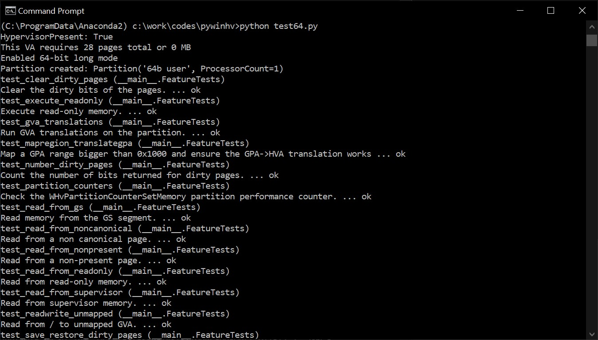

# pywinhv - Python binding for the Microsoft Hypervisor Platform APIs

This repository provides Python bindings for the [Microsoft Hypervisor Platform](https://docs.microsoft.com/en-us/virtualization/api/) APIs as well as an additional higher abstraction level.

The main purpose behind this project was to understand a bit more the APIs as well as evaluating the technology for future tooling opportunities (fuzzing, debugging, program analysis, etc.). At this point, I haven't worked on it for a while and the project is not nearly where I wanted it to be, but I think it can still be benicifial for the curious ones out there. I am / was also not aware of any available public Python bindings, so this was another motivation.

Who knows, somebody might even do something cool with them :).

<p align='center'>
    
</p>

## Overview

Microsoft has made available [a set of APIs](https://docs.microsoft.com/en-us/virtualization/api/hypervisor-platform/hypervisor-platform) that allows to interact with the Hyper-V hypervisor. You can find them declared in `WinHvPlatform.h` / `WinHvEmulation.h` / `WinHvPlatformDefs.h` and implemented respectively in `WinHvPlatform.dll` / `WinHvEmulation.dll` / `VmSavedStateDumpProvider.dll`. The `pywinhv` Python bindings are generated using [SWIG](http://www.swig.org/), built with Visual Studio 2017 and tested on Windows 1903 update (RS5) 64-bit.

To be able to use the APIs, you need to enable the runtime support for the APIs you need to install the optional opt-in feature called *Windows Hypervisor Platform* as well as a Windows 10 with the *April 2018 Update* or above. Once this is turned on, you're good to go!

The lowest layer of APIs are the raw SWIG bindings that you can access in [pywinhv](https://github.com/0vercl0k/pywinhv/blob/master/pywinhv/pywinhv.py). Those bindings are very low-level and pretty much horrible to use so I built easier to use / more pythonic verions of those APIs; here is an example with `WHvCreatePartition`:

```python
def WHvCreatePartition():
    '''
    HRESULT
    WINAPI
    WHvCreatePartition(
        _Out_ WHV_PARTITION_HANDLE* Partition
        );

    The WHvCreatePartition function creates a new partition object.
    Creating the file object does not yet create the actual partition in the hypervisor.
    To create the hypervisor partition, the WHvSetupPartition function needs to be called.
    Additional properties of the partition can be configured prior to this call;
    these properties are stored in the partition object in the VID and are applied when
    creating the partition in the hypervisor.
    '''
    Partition = whv.new_PWHV_PARTITION_HANDLE()
    Ret = whv.WHvCreatePartition(Partition)

    Success = Ret == 0
    PartitionValue = whv.PWHV_PARTITION_HANDLE_value(Partition)
    if not Success:
        PartitionValue = None

    # Release the Partition pointer.
    whv.delete_PWHV_PARTITION_HANDLE(Partition)
    return (Success, PartitionValue, Ret & 0xffffffff)
```

And finally, on top of this layer I have tried to build even higher abstraction with the `WHvPartition` or the `WHvVirtualProcessor` class:

```python
class WHvPartition(object):
    '''This is the Python abstraction for a Partition. The class
    can also be used a context manager. In this class, a lot of efforts are taken
    to hide a bunch of the WinHvPlatform APIs underlying details.
    On top of that, it makes invoking the raw APIs (exposed by SWIG) more pythonic.
    As there are a bunch of different addresses, I have tried to follow the following
    convention:
        * Partition object represent a 'guest',
        * The process from which you are instantiating the Partition is the 'host',
        * As a result - there are always three different addresses describing the same
          piece of memory:
          * The address in the host virtual address-space is an HVA,
          * The address in the guest virtual address-space is a GVA,
          * The address in the guest physical address-space is a GPA.
    '''
```

One good way to see what you can do with this class is to have a look at the [test64.py](https://github.com/0vercl0k/pywinhv/blob/master/test64.py) file where most of the APIs are tested / invoked.

## A little tour of pywinhv

The first thing you need to do is to create a partition. A partition is essentially your virtual-machine. When you create the partition, it is basically empty; it doesn't have any IDT or GDT, there is no page tables and no memory. Hell, you don't even have a virtual CPU.

So the first step is to create a partition, a virtual processor and configure basically everything depending on your needs. If you want paging or segmentation you have to configure it yourself. The function `CreatePartition` creates a Windows 64-bit like environment with paging, a virtual processor, a PML4, etc.

```Python
def CreatePartition(Pages, PackedSpacePolicy, TebGva):
    '''Create a partition and configure it like a Windows 64bit environment.'''
    Partition = hv.WHvPartition.CreateDefault('64b user')
    Vp = Partition.GetVp(0)

    # Let's enable long mode now...
    # https://wiki.osdev.org/Setting_Up_Long_Mode.
    # We basically need several things (cf https://wiki.osdev.org/X86-64):
    #   * Set the PAE enable bit in CR4
    #   * Load CR3 with the physical address of the PML4
    #   * Enable long mode by setting the EFER.LME flag in MSR 0xC0000080
    #   * Enable paging

    # OK so we need to allocate memory for paging structures, and build the
    # virtual address space.
    Pml4Gpa = hv.BuildVirtualAddressSpace(
        Partition,
        Pages,
        PackedSpacePolicy
    )

    # Turn on CR4.PAE.
    # kd> r @cr4
    # cr4=0000000000170678
    # 0b100110000011000100000
    # 'Physical Address Extension', 'Operating system support for FXSAVE and FXRSTOR instructions',
    # 'Operating System Support for Unmasked SIMD Floating-Point Exceptions',
    # 'Enables the instructions RDFSBASE, RDGSBASE, WRFSBASE, and WRGSBASE',
    # 'PCID Enable', 'Supervisor Mode Execution Protection Enable'.
    Cr4 = 0x000000000170678

    # We need to update CR3 to point to the PML4's physical address.
    Cr3 = Pml4Gpa

    # Turn on EFER.LME.
    # kd> rdmsr 0xC0000080
    # msr[c0000080] = 00000000`00000d01
    # 0b0000110100000001
    # 'System Call Extensions', 'Long Mode Enable', 'Long Mode Active', 'No-Execute Enable'.
    Efer = 0xD01

    # Turn on CR0.PG.
    # kd> r @cr0
    # Last set context:
    # cr0=0000000080050031
    # 'Protected Mode Enable', 'Extension type', 'Numeric Error', 'Write Protect',
    # 'Alignment mask', 'Paging'.
    Cr0 = 0x80050031
    Vp.SetRegisters({
        hv.Cr0 : Cr0,
        hv.Cr3 : Cr3,
        hv.Cr4 : Cr4,
        hv.Efer : Efer,
    })

    print 'Enabled 64-bit long mode'

    # We should be good to set-up 64-bit user-mode segments now.
    # 0:000> r @cs
    # cs=0033
    Cs = hv.Generate64bUserCodeSegment()
    # 0:001> r @ss
    # ss=002b
    DataSegment = hv.Generate64bUserDataSegment()
    # 0:001> r @fs
    # fs=0053
    TebSegment = hv.Generate64bUserDataSegment(TebGva)

    Vp.SetRegisters({
        hv.Cs : Cs,
        hv.Ss : DataSegment,
        hv.Ds : DataSegment,
        hv.Es : DataSegment,
        hv.Fs : DataSegment,
        hv.Gs : TebSegment,
        #_Rdx : 0, XXX Figure out where the 806e9 is coming from.
     })

    print 'Partition created:', Partition
    return Partition
```

Once this is done, the partition and processor objects expose a bunch of useful features to do:

* Memory related operations:

    * Map / unmap physical memory with `MapGpaRange` / `UnmapGpaRange`,
    * GPA to HVA translation with `TranslateGpa`,
    * GVA to GPA translation with `TranslateGva`,
    * GVA to HVA translation with `TranslateGvaToHva`,
    * Read / write GVA with `ReadGva` / `WriteGva`,

* Registers access with `GetRegisters` / `SetRegisters` and the like,

* Save / restore the state of a partition with `Save` and `Restore`.

It is also pretty easy to boostrap a partition from a crash-dump and reecreate the virtual-address space of the target for debugging (analyzing an obfuscated bootloader code in user-mode for example) or fuzzing purposes (track dirty pages and snapshot / restore the environmen for example).

Anyways, I hope you have a look around and get as excited as I am about this new technology :).

## Building

To compile the Python bindings you need to install the Windows 10.0.17134.0 SDK, Visual Studio 2017 (that is the only version I have personally tested) and [SWIG](http://www.swig.org/). Edit the file `build\Makefile` and update both the variables `PYTHON_INC` and `PYTHON_LIB` with appropriate paths.

Once this is done, open an *x64 Native Tools Command Prompt for VS2017* and run the following commands:

```text
(C:\ProgramData\Anaconda2) c:\work\codes\pywinhv>set SWIG_EXE=C:\Users\over\Downloads\swigwin-3.0.12\swigwin-3.0.12\swig.exe

(C:\ProgramData\Anaconda2) c:\work\codes\pywinhv>cd build

(C:\ProgramData\Anaconda2) c:\work\codes\pywinhv\build>nmake

Microsoft (R) Program Maintenance Utility Version 14.16.27026.1
Copyright (C) Microsoft Corporation.  All rights reserved.

        C:\Users\over\Downloads\swigwin-3.0.12\swigwin-3.0.12\swig.exe -v -Iinc -I"C:\Program Files (x86)\Windows Kits\10\Include\10.0.17763.0\um" -I"C:\Program Files (x86)\Windows Kits\10\Include\10.0.17763.0\shared" -outdir ..\pywinhv -o src\_pywinhv.c -python swig\_pywinhv.i
Language subdirectory: python
Search paths:
   .\
   inc\
   C:\Program Files (x86)\Windows Kits\10\Include\10.0.17763.0\um\
   C:\Program Files (x86)\Windows Kits\10\Include\10.0.17763.0\shared\
   .\swig_lib\python\
   C:\Users\over\Downloads\swigwin-3.0.12\swigwin-3.0.12\Lib\python\
   .\swig_lib\
   C:\Users\over\Downloads\swigwin-3.0.12\swigwin-3.0.12\Lib\
Preprocessing...
Starting language-specific parse...
[...]
Processing unnamed structs...
Processing types...
C++ analysis...
Generating wrappers...
        cl.exe /nologo /W3 /I C:\ProgramData\Anaconda2\include /I inc /D_AMD64_ /c src\_pywinhv.c /Fosrc\_pywinhv.c.o
_pywinhv.c
        link.exe /DLL /nologo /debug:full C:\ProgramData\Anaconda2\libs\python27.lib winhvplatform.lib winhvemulation.lib /out:_pywinhv.pyd src\_pywinhv.c.o
   Creating library _pywinhv.lib and object _pywinhv.exp
        copy _pywinhv.pyd ..\pywinhv
        1 file(s) copied.
Testing...
        python test.py
HyperviorPresent: True
```

## References

* [VirtualBox source-code](https://www.virtualbox.org/browser/vbox/trunk) for its usage of WHV,
* [Simpleator](https://github.com/ionescu007/Simpleator).